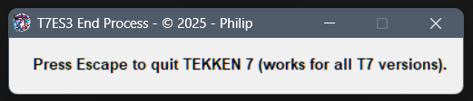

# t7es3-end-process

**Kills all Tekken 7 game  processes (for all versions on PC, PC versions and Arcade versions).**              

> Sometimes .exes are named differently make sure it's always: TekkenGame-Win64-Shipping.exe    

---

                        
**[RobertoTorino](https://github.com/RobertoTorino)**           